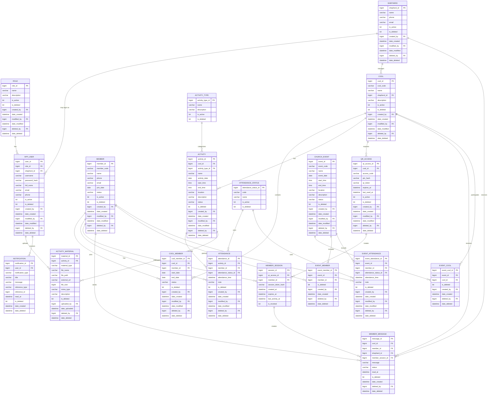

# ERD — Sistem Manajemen COOL GBI Salemba

Dokumen ini mendefinisikan rancangan database awal untuk Sistem Manajemen COOL GBI Salemba. Struktur dibuat untuk mendukung **MVP/Phase 1** sekaligus tetap siap dikembangkan untuk **akun anggota dan event gereja pada Phase 2**.

> ERD menggunakan Mermaid. Dapat dirender pada editor yang mendukung Mermaid, misalnya GitHub atau Mermaid Live Editor.

---

## 1. ERD Utama



---

# 2. Penjelasan Table

## A. Authentication & Authorization

### `ROLE`

Master data role aplikasi.

Contoh:

```text
1 - MASTER
2 - SHEPHERD
```

Phase 2 dapat menambahkan:

```text
3 - MEMBER
```

---

### `APP_USER`

Akun yang dapat login ke aplikasi.

Pada MVP hanya:

- Master.
- Gembala.

Pada Phase 2:

- Member.

Field penting:

```text
user_id
role_id
shepherd_id
username
password_hash
```

`shepherd_id` hanya diisi jika user tersebut merupakan Gembala.

---

## B. COOL & Person

### `SHEPHERD`

Menyimpan data Gembala COOL.

Satu Gembala dapat memiliki satu atau beberapa COOL jika business rule gereja mengizinkan.

Relationship:

```text
SHEPHERD 1 ---- N COOL
```

---

### `COOL`

Master data kelompok COOL.

Contoh:

```text
cool_id: 1
cool_code: COOL-SLM-001
name: COOL Salemba 01
shepherd_id: 5
```

---

### `MEMBER`

Menyimpan data orang/anggota.

Member sengaja dipisahkan dari `APP_USER`.

Alasannya:

**Phase 1:**

```text
MEMBER
  ↓
tidak memiliki akun
```

**Phase 2:**

```text
MEMBER
  ↓
APP_USER
```

Dengan begitu database tidak perlu didesain ulang ketika akun anggota ditambahkan.

---

### `COOL_MEMBER`

Tabel penghubung antara COOL dan anggota.

Walaupun Phase 1 hanya memperbolehkan satu COOL aktif per anggota, tabel ini tetap disarankan karena dapat menyimpan histori perpindahan COOL.

Contoh:

```text
Andi
  ↓
COOL A
2025-01-01 s/d 2025-06-30

Andi
  ↓
COOL B
2025-07-01 s/d NULL
```

Dengan desain ini, histori anggota tetap tersedia.

---

# 3. Activity

### `ACTIVITY_TYPE`

Master jenis kegiatan.

Contoh:

```text
IBADAH
FELLOWSHIP
DOA
SHARING
SOSIAL
LAINNYA
```

---

### `ACTIVITY`

Menyimpan kegiatan COOL.

Relationship:

```text
COOL
  |
  +---- ACTIVITY
          |
          +---- ATTENDANCE
          |
          +---- ACTIVITY_MATERIAL
```

Contoh:

```text
COOL Salemba 01
    |
    +-- Ibadah COOL - 10 Sep 2026
    +-- Fellowship - 17 Sep 2026
    +-- Ibadah COOL - 24 Sep 2026
```

---

# 4. Attendance

### `ATTENDANCE_STATUS`

Master status absensi.

Contoh:

```text
PRESENT  = Hadir
ABSENT   = Tidak Hadir
EXCUSED  = Izin
SICK     = Sakit
```

Sebaiknya menggunakan master table daripada enum/hard-code supaya status dapat dikembangkan.

---

### `ATTENDANCE`

Record absensi anggota pada kegiatan COOL.

Relationship:

```text
ACTIVITY
   |
   +---- ATTENDANCE ---- MEMBER
```

Constraint yang disarankan:

```text
UNIQUE(activity_id, member_id)
```

Namun karena sistem menggunakan soft delete, unique constraint perlu dirancang hati-hati.

Contohnya bisa menggunakan filtered unique index:

```sql
WHERE is_deleted = 0
```

Tujuannya agar satu anggota hanya mempunyai satu record absensi aktif untuk satu kegiatan.

---

# 5. Material

### `ACTIVITY_MATERIAL`

Menyimpan materi atau dokumen yang berkaitan dengan kegiatan.

Bisa berupa:

```text
PDF
DOCX
PPTX
IMAGE
EXTERNAL_LINK
```

Jangan menyimpan binary file langsung di database jika tidak ada kebutuhan khusus.

Lebih baik:

```text
File Storage
     ↓
ACTIVITY_MATERIAL.file_path
```

atau:

```text
Object Storage
     ↓
ACTIVITY_MATERIAL.file_path
```

Untuk external link:

```text
external_url
```

yang digunakan.

---

# 6. QR Access

### `QR_ACCESS`

Mengatur akses anggota ke halaman COOL pada Phase 1.

Contoh flow:

```text
QR Code
   ↓
qr_token
   ↓
COOL
   ↓
Input PIN
   ↓
pin_hash verification
   ↓
MEMBER_SESSION
   ↓
COOL Page
```

PIN tidak disimpan dalam plaintext.

Field:

```text
pin_hash
```

bukan:

```text
pin
```

---

### `MEMBER_SESSION`

Direkomendasikan untuk menyimpan session hasil autentikasi QR + PIN.

Tujuannya agar setelah PIN berhasil diverifikasi, pengguna tidak perlu mengirim PIN pada setiap request.

Contoh:

```text
QR + PIN
   ↓
Verify PIN
   ↓
Create session
   ↓
Session Token
   ↓
Access COOL
```

`session_token_hash` disimpan dalam bentuk hash.

Session harus mempunyai expiration.

---

# 7. Message

### `MEMBER_MESSAGE`

Pesan dari anggota kepada Gembala.

Contoh:

```text
Member
   ↓
MEMBER_MESSAGE
   ↓
COOL
   ↓
SHEPHERD
```

`member_session_id` digunakan untuk mengetahui session yang membuat pesan pada Phase 1.

`member_id` dapat digunakan jika identitas anggota sudah diketahui.

---

# 8. Notification

### `NOTIFICATION`

Notifikasi untuk user aplikasi.

Contoh:

```text
Member mengirim pesan
        ↓
MEMBER_MESSAGE
        ↓
NOTIFICATION
        ↓
Gembala
```

Contoh notification:

```text
Title:
Pesan Baru

Message:
Ada pesan baru dari anggota COOL Salemba 01.
```

Phase berikutnya dapat menambahkan notification provider:

```text
In-App
Email
WhatsApp
Push Notification
```

---

# 9. Church Event — Phase 2

### `CHURCH_EVENT`

Event yang dikelola di level gereja dan dapat melibatkan banyak COOL.

Contoh:

```text
Ibadah COOL Gabungan
```

---

### `EVENT_COOL`

Many-to-many relationship:

```text
CHURCH_EVENT N ---- N COOL
```

Contoh:

```text
Ibadah COOL Gabungan
    |
    +-- COOL Salemba 01
    +-- COOL Salemba 02
    +-- COOL Salemba 03
```

---

### `EVENT_MEMBER`

Daftar anggota yang menjadi peserta event.

Ini dipisahkan dari `EVENT_COOL` agar sistem dapat menentukan apakah seluruh anggota COOL atau hanya anggota tertentu yang mengikuti event.

---

### `EVENT_ATTENDANCE`

Absensi anggota pada event gereja.

Contoh:

```text
CHURCH_EVENT
     |
     +---- EVENT_ATTENDANCE
                |
                +---- MEMBER
```

Dengan ini, statistik dapat membedakan:

```text
Kehadiran kegiatan COOL
```

dan

```text
Kehadiran event gereja
```

---

# 10. Soft Delete

Hampir seluruh business table menggunakan:

```text
is_deleted
deleted_by
date_deleted
```

Contoh:

```sql
SELECT *
FROM activity
WHERE is_deleted = 0;
```

Untuk tabel yang memiliki histori, **jangan hard delete**.

Contoh:

Jika kegiatan dihapus:

```text
ACTIVITY
   ↓
is_deleted = 1
```

Maka histori:

```text
ATTENDANCE
```

tetap tersedia.

Hal ini penting untuk laporan/statistik historis.

---

# 11. Recommended Index

Index yang disarankan:

```text
COOL
- shepherd_id
- is_deleted

COOL_MEMBER
- cool_id
- member_id
- status
- is_deleted

ACTIVITY
- cool_id
- activity_date
- is_deleted

ATTENDANCE
- activity_id
- member_id
- attendance_status_id
- is_deleted

ACTIVITY_MATERIAL
- activity_id
- is_deleted

QR_ACCESS
- cool_id
- qr_token
- is_active
- is_deleted

MEMBER_SESSION
- session_token_hash
- expires_at
- is_revoked

MEMBER_MESSAGE
- cool_id
- shepherd_id
- member_id
- date_created
- is_deleted

NOTIFICATION
- user_id
- read_at
- date_created

EVENT_COOL
- event_id
- cool_id

EVENT_MEMBER
- event_id
- member_id

EVENT_ATTENDANCE
- event_id
- member_id
- attendance_status_id
```

---

# 12. Recommended Unique Constraints

Beberapa data sebaiknya memiliki unique constraint.

```text
COOL
UNIQUE(cool_code)

MEMBER
UNIQUE(member_code)

COOL_MEMBER
UNIQUE(cool_id, member_id, start_date)

ATTENDANCE
UNIQUE(activity_id, member_id)
WHERE is_deleted = 0

EVENT_COOL
UNIQUE(event_id, cool_id)
WHERE is_deleted = 0

EVENT_MEMBER
UNIQUE(event_id, member_id)
WHERE is_deleted = 0

EVENT_ATTENDANCE
UNIQUE(event_id, member_id)
WHERE is_deleted = 0
```

Untuk `username`, gunakan:

```text
UNIQUE(username)
```

---

# 13. Simplified Relationship

Jika ingin melihat struktur paling sederhananya:

```text
                 ┌─────────────┐
                 │    ROLE     │
                 └──────┬──────┘
                        │
                        ▼
                 ┌─────────────┐
                 │  APP_USER   │
                 └──────┬──────┘
                        │
                        │
                 ┌──────▼──────┐
                 │  SHEPHERD   │
                 └──────┬──────┘
                        │
                        │
                 ┌──────▼──────┐
                 │    COOL     │
                 └──┬─────┬────┘
                    │     │
             ┌──────┘     └──────────┐
             ▼                        ▼
      ┌─────────────┐          ┌─────────────┐
      │ COOL_MEMBER │          │   ACTIVITY  │
      └──────┬──────┘          └──────┬──────┘
             │                        │
             ▼                        ├──────────────┐
       ┌───────────┐                   ▼              ▼
       │  MEMBER   │             ATTENDANCE      MATERIAL
       └─────┬─────┘
             │
             └──────────────┐
                            ▼
                     MEMBER_MESSAGE
                            │
                            ▼
                     NOTIFICATION

PHASE 2:

       COOL ───── EVENT_COOL ───── CHURCH_EVENT
        │                              │
        │                              │
      MEMBER ───── EVENT_MEMBER ───────┤
        │                              │
        └──── EVENT_ATTENDANCE ────────┘
```

---

# 14. Important Design Decision

### Jangan membuat tabel statistik secara langsung untuk MVP

Tidak perlu membuat:

```text
MEMBER_STATISTIC
COOL_STATISTIC
ATTENDANCE_STATISTIC
```

untuk tahap awal.

Statistik dapat dihitung dari:

```text
COOL
+
MEMBER
+
COOL_MEMBER
+
ACTIVITY
+
ATTENDANCE
```

Contoh:

```text
Total hadir
= COUNT(ATTENDANCE)
WHERE attendance_status = PRESENT
```

Kemudian:

```text
Attendance Rate
= Total Hadir / Total Kegiatan × 100%
```

Jika jumlah data sudah sangat besar dan query statistik menjadi bottleneck, barulah dapat dipertimbangkan summary table/materialized reporting.

---

# 15. Recommended MVP Tables

Jika ingin mulai development dari yang paling penting, buat tabel berikut terlebih dahulu:

```text
1. ROLE
2. APP_USER
3. SHEPHERD
4. COOL
5. MEMBER
6. COOL_MEMBER
7. ACTIVITY_TYPE
8. ACTIVITY
9. ATTENDANCE_STATUS
10. ATTENDANCE
11. ACTIVITY_MATERIAL
12. QR_ACCESS
13. MEMBER_SESSION
14. MEMBER_MESSAGE
15. NOTIFICATION
```

Phase 2:

```text
16. CHURCH_EVENT
17. EVENT_COOL
18. EVENT_MEMBER
19. EVENT_ATTENDANCE
```

---

# 16. Suggested Implementation Order

Urutan development database:

```text
ROLE
  ↓
SHEPHERD
  ↓
APP_USER
  ↓
COOL
  ↓
MEMBER
  ↓
COOL_MEMBER
  ↓
ACTIVITY_TYPE
  ↓
ACTIVITY
  ↓
ATTENDANCE_STATUS
  ↓
ATTENDANCE
  ↓
ACTIVITY_MATERIAL
  ↓
QR_ACCESS
  ↓
MEMBER_SESSION
  ↓
MEMBER_MESSAGE
  ↓
NOTIFICATION
  ↓
[PHASE 2]
CHURCH_EVENT
  ↓
EVENT_COOL
  ↓
EVENT_MEMBER
  ↓
EVENT_ATTENDANCE
```

---

# 17. Catatan untuk AI/Coding Agent

Saat mengimplementasikan database dari ERD ini:

1. Jangan membuat hard delete untuk business entity.
2. Semua query normal harus memfilter `is_deleted = 0`.
3. Jangan mempercayai `cool_id` dari frontend untuk authorization Gembala.
4. Scope data Gembala harus diverifikasi dari authenticated user → shepherd → COOL.
5. PIN QR harus di-hash dan tidak boleh disimpan plaintext.
6. Session token sebaiknya disimpan dalam bentuk hash.
7. Jangan menyimpan file PDF sebagai binary database kecuali ada alasan teknis yang jelas.
8. Gunakan foreign key untuk menjaga referential integrity.
9. Tambahkan index berdasarkan pola query.
10. Jangan membuat tabel statistik pada MVP; hitung dari histori absensi.
11. Struktur `COOL_MEMBER` dipertahankan agar histori perpindahan anggota dapat didukung.
12. Pisahkan `ACTIVITY` dan `CHURCH_EVENT` karena scope keduanya berbeda.
13. Gunakan UTC untuk timestamp di backend/database jika aplikasi nantinya memiliki kemungkinan timezone berbeda; tampilkan waktu dalam timezone lokal pengguna.
14. Semua tabel transaksi penting sebaiknya memiliki audit fields.
15. Migration harus versioned dan dapat dijalankan secara konsisten di development, staging, dan production.
